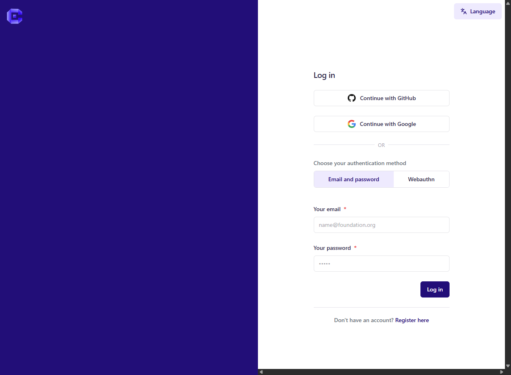
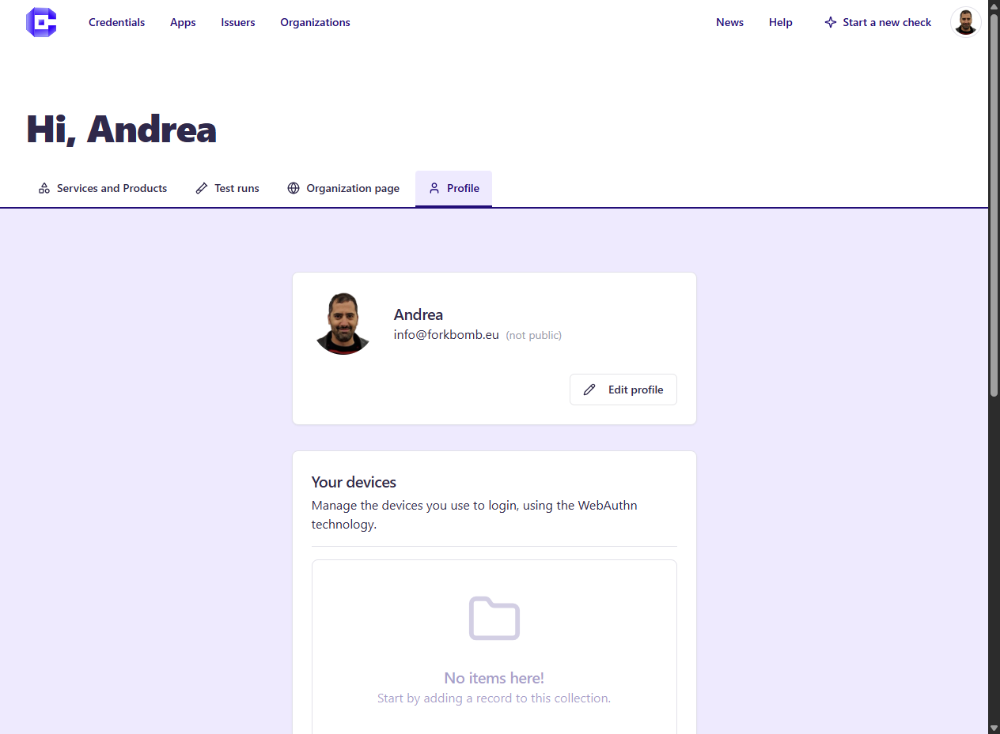
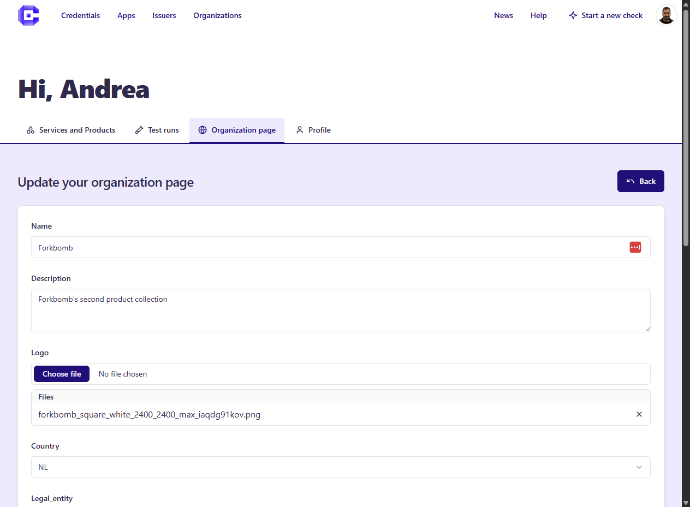

# 👤 Create Account, Developer Dashboard

All the testing and Marketplace publishing features, require the creation of a User Account.

## Create Account
You can create a User Account by clicking on **Login** in the top right of the Home

## Editing Profile
Once you have created an Account, a button on top right will appear, from there you can access and edit the **Profile** page

## Developer Dashboard
Once you have created an Account, a button on top right will appear, from there you can access the **Dashboard**, there you can: 
- Start a Compliance Check, click on **Start a new check**
- View the **History of your Checks**: you can access your current past checks, that have been started via Web-GUI or via REST-API along with the reports.
- Edit your **Organization**: you will need this to publish your product and services on the Marketplace
- Edit your **Products and Services**: here you can edit your Apps, Issuers and Verifiers that you want to publish on the Marketplace

