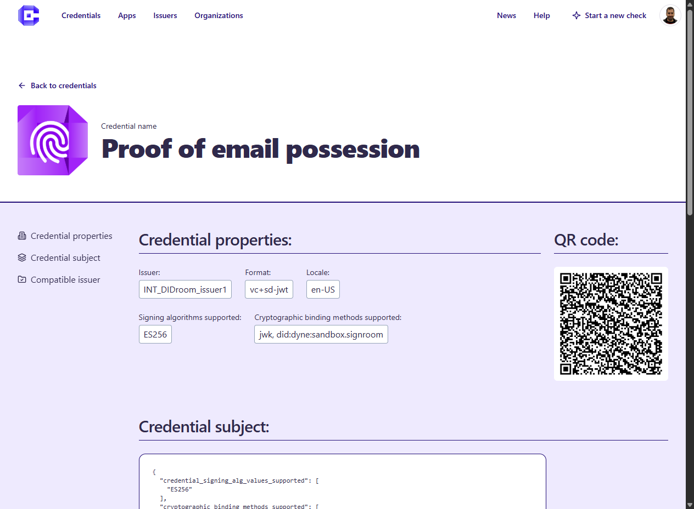

# 🏪 Marketplace

The Marketplace, contains:
 - Searchable list of **Verifiable Credentials** that are offered on the Marketplace (for testing or commercial purposes)
 - Searchable list of **software products and services**, such as Wallets, Issuers, Verifiers 
 - For each product and service, a list of the performed conformance checks (along with the latest results) are also visible

Anyone can browse the Marketplace, no user account is required

## Browse products and services
Credimi's Marketplace showcases **Mobile Apps** (typically Wallets), **Credentials**, **Issuers** and **Verifiers**. 

Browse the Marketplace, use the filters or search for products or services using keywords and tags. 

## Search Credentials

Credentials can be browsed and (when available) you can try to obtain them with your Wallet using the QR Code:

## Browse and search compliance scores
(Coming soon)

