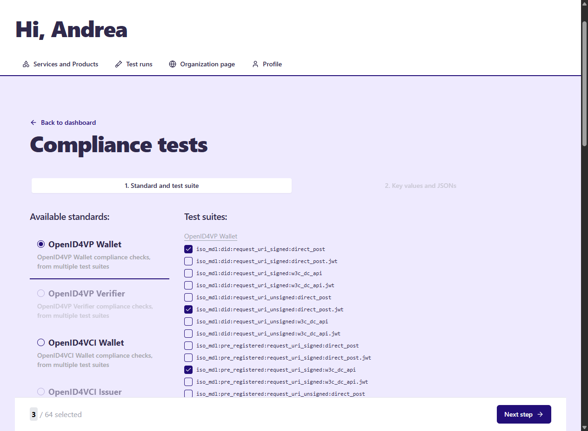
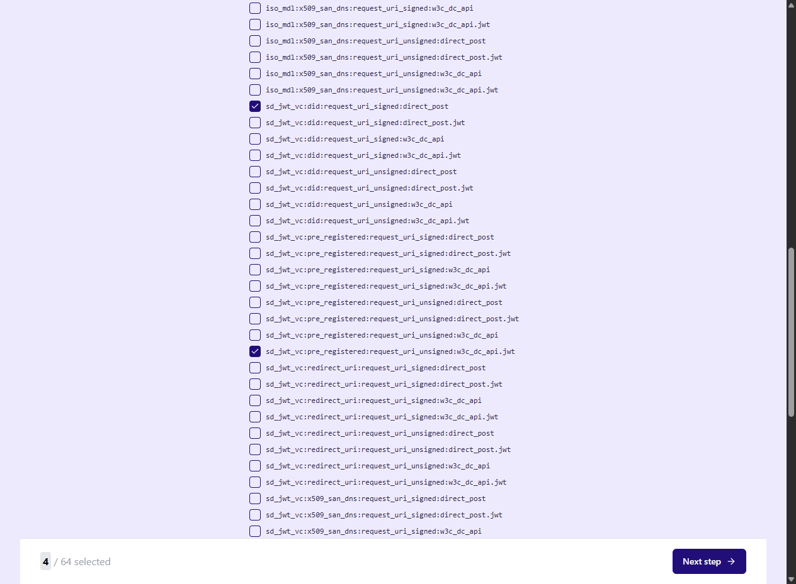
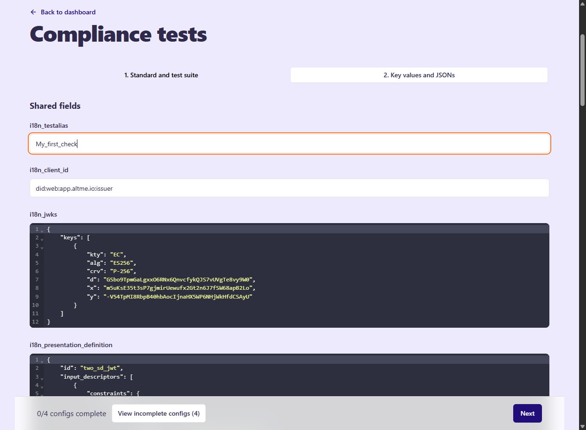
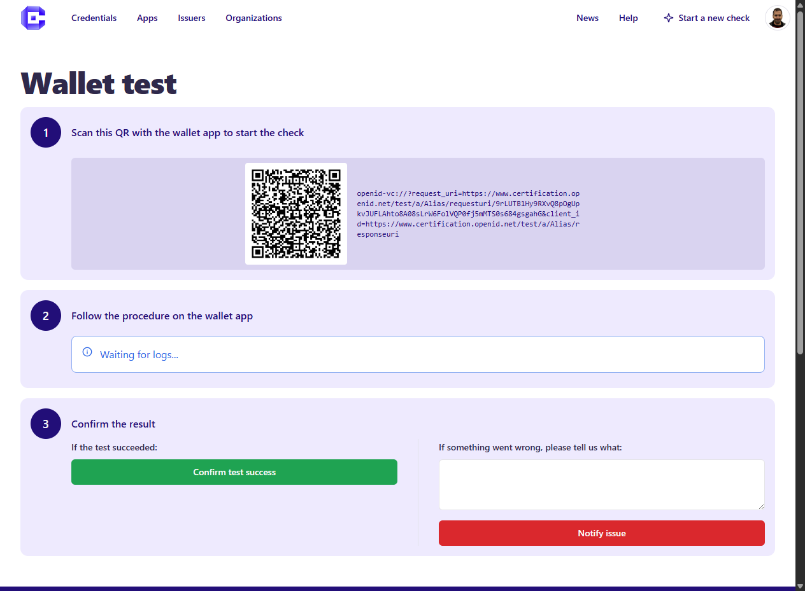
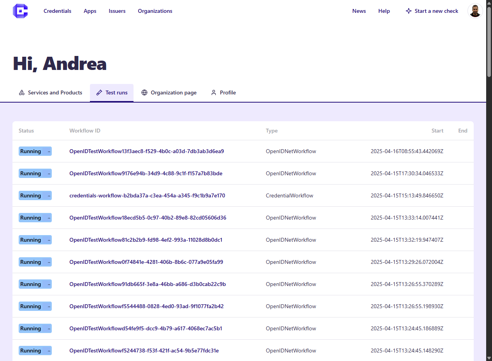
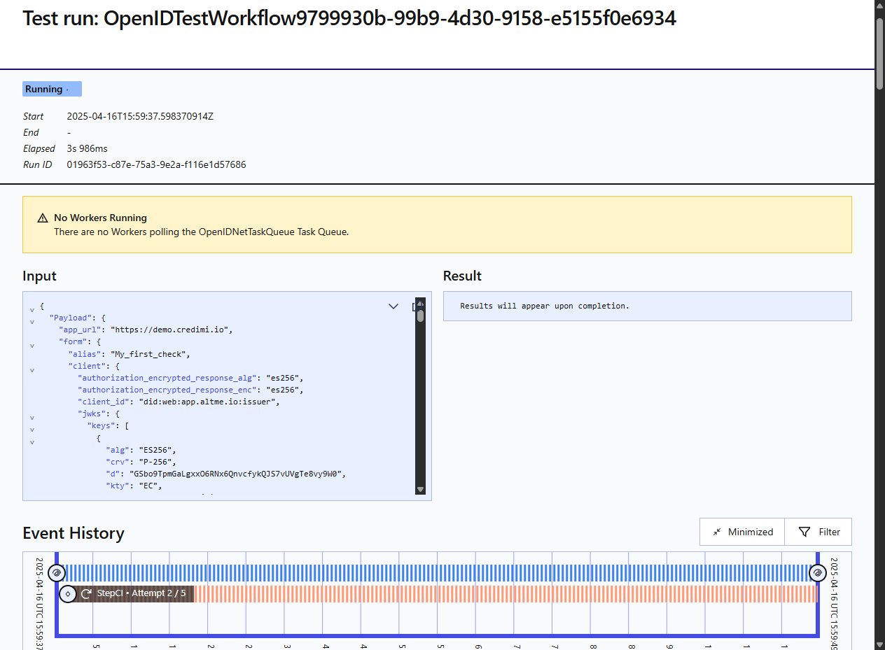

# ✅ Run Compliance Checks

Credimi enables developers as well non-tech users, to test Identity Solutions (Wallets, Issuers, Verifiers) against multiple testing suites ([OpenID Foundation](https://staging.certification.openid.net/), [EWC Consortium](https://github.com/EWC-consortium/ewc-wallet-conformance-backend) and [W3C-VC Issuance](https://github.com/w3c-ccg/vc-api-issuer-test-suite)/[W3C-VC Verification](https://github.com/w3c-ccg/vc-api-verifier-test-suite) at once. 

Currently we Credimi offers: 

- OpenID4VP Wallet (OpenID Foundation, EWC)
- OpenID4VP Verifier (OpenID Foundation, EWC)

- OpenID4CI Wallet (OpenID Foundation, EWC)
- OpenID4CI Issuer (OpenID Foundation, EWC) 

- W3C-VC Issuer (VC-API)
- W3C-VC Verifier (VC-API)

## Manually, via Web-GUI 
Once you have logged-in, you can start a new check by clicking on  *Start a new check* in the top-right corner of the GUI:

#### Select one or more tests, enter input

After selecting the tests you want to execute, fill in the forms to provide the data required by the test configuration you selected:

When you're done, you should receive one (or more) email with a link (or multiple), clicking on a link will lead you to a test page:

#### Check your test runs

At this point, from the **Developer Dashboard > Test Runs** you can check the list and the status of the tests you are running: 

And by clicking on one of the tests, you will see the details of the single test: 

## Via API, CI, Github Actions
(documentation coming soon)

## Via CLI
(documentation coming soon)

## Automatized mobile testing
Credimi integrates with [Maestro](https://maestro.dev/) for automatized mobile testing (documentation coming soon).

## Scheduled Checks  
Credimi also allows you schedule tests via Web-GUI or REST API (documentation coming soon).