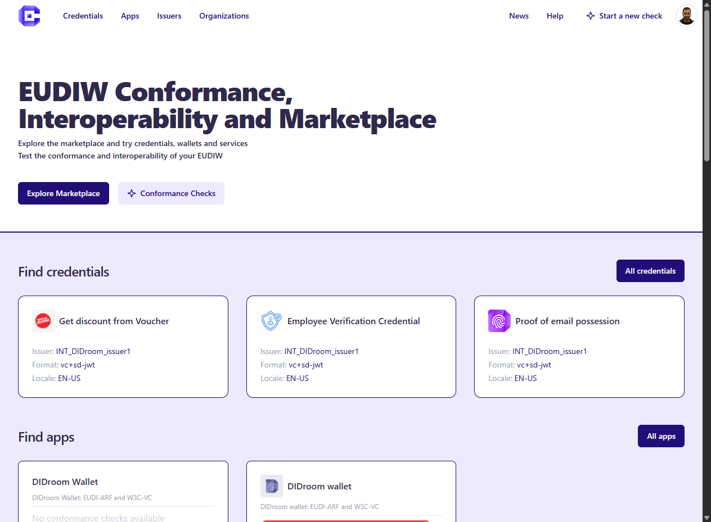
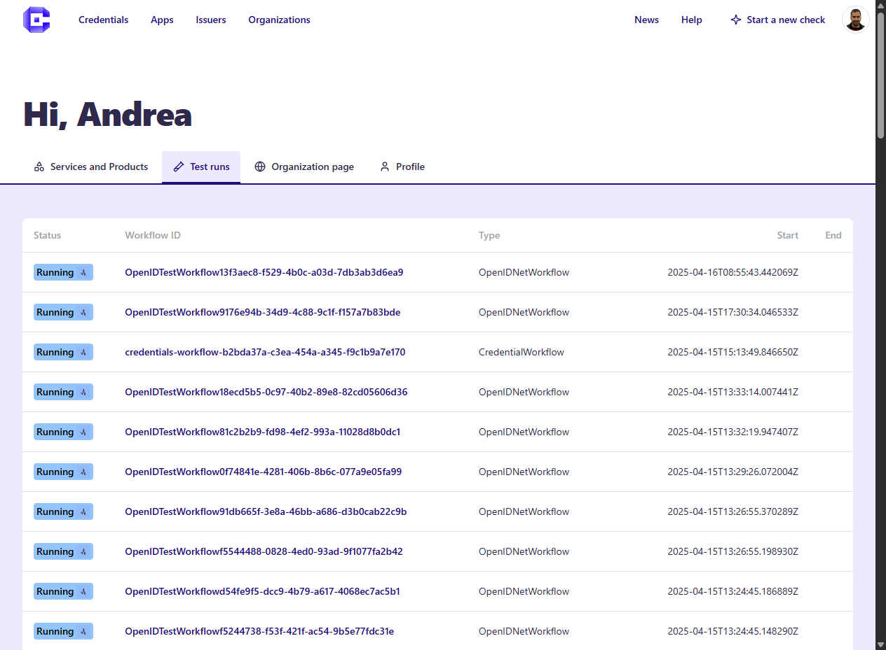
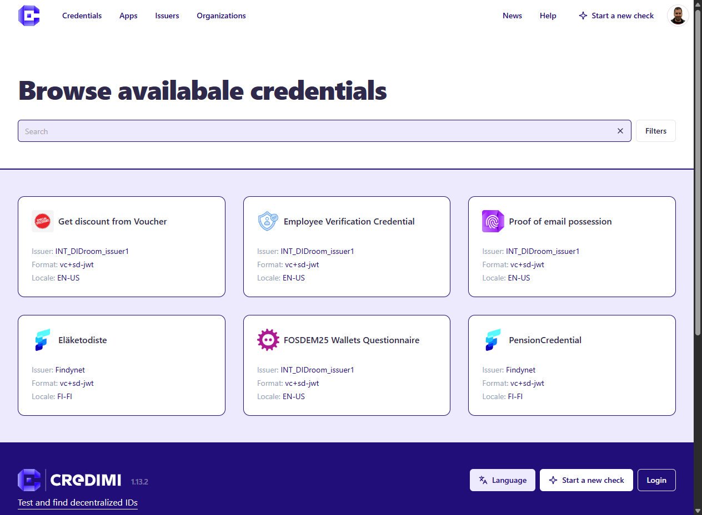

# Welcome to Credimi 😊

**Credimi** was built to enable EUDI-ARF developers, government organizations and end-users to test compliance and interoperability of Digital Identity solutions. 

Below is a summary of Credimi's features organized by stakeholder category.

## Are you a Developer? 
Create an **User Account**, access the **Developer Dashboard** and: 
- Test your Identity solution for compliance: start or schedule multiple compliance checks via GUI, REST-API or CLI. Each check produces a report accessible from the Developer Dashboard.
- Publish your product and services to the Marketplace: feature your Wallet, Issuer, Verifier, as well as list of the Verifiable Credentials that your solution offers. 
- Automatize testing: schedule your compliance check via CI (or Github Actions) and automatize mobile testing using Credimi's integration with [Maestro](https://maestro.dev/)
- Check the News page for the latest digest of Identity Standard and News

## Are you an End-user?
Browse the Marketplace to:

- Search and compare Identity products and services
- Request and verify Verifiable Credentials 
- Compare the compliance level of Identity products and services

## Are you standardazing body or government organization?

- Gather collections of test reports, to assess industry readyness of protocols and solutions
- Compare your testing suites with the existing ones 
- Explore and compare existing solutions
