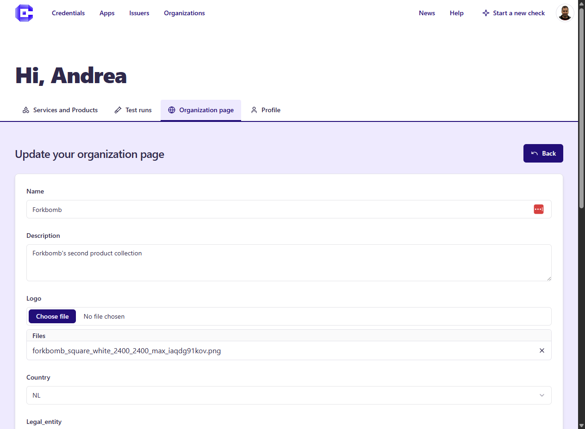

# 🚀 Publish on the Marketplace

Any registered user can publish Products and Services (Wallets, Issuers, Verifiers) on the Marketplace. 

In order to publish a Product/Service, first an organization must be configured. After that, there are different paths to create or import a Product/Service.

## Create an organization
When you sign-up as new User, an empty organization is also created. This organization can be edited in the Developer Dashboard. 

## Add a Product/Service
There are different paths to create Producs (typically Mobile Wallets) and Services (typically Credential Issuance and Verification): 

#### Add a Wallet

- Products (Wallets): click on **Add Wallet** and fill all the fields. A Product is created from scratch and later edited. The Product contains primarily metadata (name, description, logo, links). 

#### Add a Credential (...add a Credential Issuer first!)

- Credential Issuance: in order to add a Crdential Issuance service, you first need to setup an Issuer. You can start the process by clicking on **Add a Credential Issuer**. Upon entering an Issuer's URL in the windows, all the Credentials offered by the Issuer are (should be!) automatically created and populated. 

Following that, for each Credential, a deeplink (with a corresponding auto-generated QR Code) will be auto-generated and can be modified manually. This allows **visitors to test the Credential Issuance Flow with their Wallets**.

#### Add a Verifier 
- Credential Verification: (coming soon)

