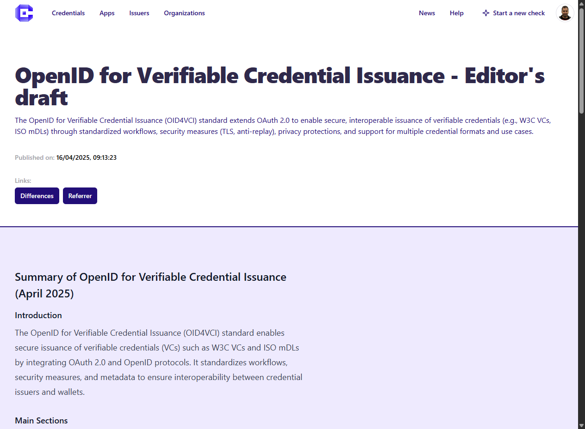

# 📰 News page

Credimi features an auto-populated News section, offering condensed news focusing on changes of standards, relevant open source repos an specialized news channels.

The News section is available in the Home as well as linked in the top-right of the homepage. 

Click on a News card to open it: 

## Standards and groups
The standards currently being followed are EUDI-ARF, OpenID4VCI/OpenID4VP, W3C-VC, BBS. 

## Suggest pages to follow
Want us to add a topic, a standard or a page? Email us at didimo-news@forkbomb.eu 

